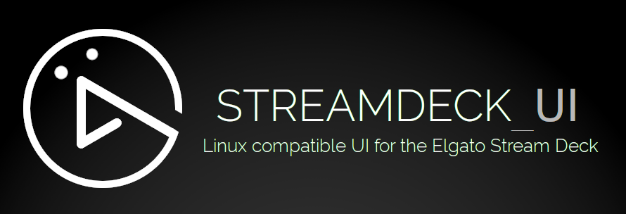

[](https://timothycrosley.github.io/streamdeck-ui/)
_________________

[](http://badge.fury.io/py/streamdeck-ui)
[](https://github.com/timothycrosley/streamdeck-ui/actions?query=workflow%3ATest)
[](https://github.com/timothycrosley/streamdeck-ui/actions?query=workflow%3ALint)
[](https://codecov.io/gh/timothycrosley/streamdeck-ui)
[](https://gitter.im/timothycrosley/streamdeck-ui?utm_source=badge&utm_medium=badge&utm_campaign=pr-badge&utm_content=badge)
[](https://pypi.python.org/pypi/streamdeck-ui/)
[](https://pepy.tech/project/streamdeck-ui)
[](https://github.com/psf/black)
[](https://timothycrosley.github.io/isort/)
 
_________________

[Read Latest Documentation](https://timothycrosley.github.io/streamdeck-ui/) - [Browse GitHub Code Repository](https://github.com/timothycrosley/streamdeck-ui/)
_________________

**streamdeck_ui** A Linux compatible UI for the Elgato Stream Deck.


## Key Features

* **Linux Compatible**: Enables usage of all Stream Deck devices on Linux without needing to code.
* **Multi-device**: Enables connecting and configuring multiple Stream Deck devices on one computer.
* **Brightness Control**: Supports controlling the brightness from both the configuration UI and buttons on the device itself.
* **Configurable Button Display**: Icons + Text, Icon Only, and Text Only configurable per button on the Stream Deck.
* **Multi-Action Support**: Run commands, write text and press hotkey combinations at the press of a single button on your Stream Deck.
* **Button Pages**: streamdeck_ui supports multiple pages of buttons and dynamically setting up buttons to switch between those pages.
* **Auto Reconnect**: Automatically and gracefully reconnects, in the case the device is unplugged and replugged in.
* **Import/Export**: Supports saving and restoring Stream Deck configuration.

Communication with the Streamdeck is powered by the [Python Elgato Stream Deck Library](https://github.com/abcminiuser/python-elgato-streamdeck#python-elgato-stream-deck-library).

## Linux Quick Start
### Precooked Scripts
There are scripts for setting up streamdeck_ui on [Debian/Ubuntu](scripts/ubuntu_install.sh) and [Fedora](scripts/fedora_install.sh).
### Manual installation
To use streamdeck_ui on Linux, you will need first to install some pre-requisite system libraries.
The name of those libraries will differ depending on your Operating System.  
Debian / Ubuntu:
```bash
sudo apt install libhidapi-hidraw0 libudev-dev libusb-1.0-0-dev python3-pip
```
Fedora:
```bash
sudo dnf install python3-devel libusb-devel python3-pip libusbx-devel libudev-devel hidapi
```
If you're using GNOME shell, you might need to manually install an extension that adds [KStatusNotifierItem/AppIndicator Support](https://extensions.gnome.org/extension/615/appindicator-support/) to make the tray icon show up.

To use streamdeck_ui without root permissions, you have to give your user full access to the device.

Add the udev rules using your text editor:
```bash
sudoedit /etc/udev/rules.d/70-streamdeck.rules
# If that doesn't work, try:
sudo nano /etc/udev/rules.d/70-streamdeck.rules
```
Paste the following lines:
```
SUBSYSTEM=="usb", ATTRS{idVendor}=="0fd9", ATTRS{idProduct}=="0060", TAG+="uaccess"
SUBSYSTEM=="usb", ATTRS{idVendor}=="0fd9", ATTRS{idProduct}=="0063", TAG+="uaccess"
SUBSYSTEM=="usb", ATTRS{idVendor}=="0fd9", ATTRS{idProduct}=="006c", TAG+="uaccess"
SUBSYSTEM=="usb", ATTRS{idVendor}=="0fd9", ATTRS{idProduct}=="006d", TAG+="uaccess"
```
Reload the rules:
```
sudo udevadm control --reload-rules
```
Make sure you unplug and replug your device before continuing.
Once complete, you should be able to install streamdeck_ui.
Installing the application itself is done via pip:
```bash
pip3 install --user streamdeck_ui
```
Make sure to include `$HOME/.local/bin` to your PATH.  
If you haven't already, add
```bash
PATH=$PATH:$HOME/.local/bin
```
to the bottom your shell config file (most likely .bashrc in your home directory)

You can then launch `streamdeck` to start configuring your device.

```bash
streamdeck
```

It's recommended that you include `streamdeck` in your windowing environment's list of applications to auto-start.

## Generic Quick Start

On other Operating Systems, you'll need to install the required [dependencies](https://github.com/abcminiuser/python-elgato-streamdeck#package-dependencies) of the library.
After that, use pip to install the app:

```bash
pip3 install streamdeck_ui --user
streamdeck
```
## Help
### Command
Enter a value in the command field to execute a command. For example, `gnome-terminal` will launch a new terminal on Ubuntu or `obs` will launch OBS.

#### Some examples (Ubuntu)
You can use a tool like `xdotool` to interact with other applications.

Find the window with a title starting with `Meet - ` and bring it to focus. This helps if you have a Google Meet session on a tab somewhere but you lost it behind another window. 
```bash
xdotool search --name '^Meet - .+$' windowactivate 
```
> The meeting tab must be active one if you have multiple tabs open, since the window title is set by the currently active tab.

Find the window with a title starting with `Meet - ` and then send `ctrl+d` to it. This has the effect of toggling the mute button in Google Meet.
```bash
xdotool search --name '^Meet - .+$' windowactivate --sync key ctrl+d
```

Change the system volume up (or down) by a certain percentage. Assumes you're using PulseAudio/Alsa Mixer.
```
amixer -D pulse sset Master 20%+
```
### Press Keys
Simulates key press combinations (hot keys). The basic format is a group of keys, seperated by a `+` sign to press simultaneously. Seperate key combination groups with a `,` if additional key combinations are needed. For example, `alt+F4,f` means press and hold `alt`, followed by `F4` and then release both. Next, press and release `f`. 

> Use `comma` or `plus` if you want to actually *output* `,` or `+` respectively.
> Use `delay` to add a short (0.5 seconds) delay. 

#### Examples
- `F11` - Press F11. If you have focus on a browser this will toggle full screen.
- `alt+F4` - Closes the current window.
- `ctrl+w` - Closes the current browser tab.
- `cmd+left` - View split on left. Note `cmd` is the **super** key (equivalent of the Windows key).
- `alt+plus` - Presses the alt and the `+` key at the same time.
- `alt+delay+F4` - Press alt, then wait 0.5 seconds, then press F4. Release both.
- `1,delay,delay,2,delay,delay,3` - Type 123 with a second delay between keypresses.

The standard list of keys can be found [at the source](https://pynput.readthedocs.io/en/latest/_modules/pynput/keyboard/_base.html#Key).

## Known issues

- Streamdeck uses [pynput](https://github.com/moses-palmer/pynput) for simulating **Key Presses** but it lacks proper [support for Wayland](https://github.com/moses-palmer/pynput/issues/189). Your mileage on Fedora will vary! Generally your results will be good when using X (Ubuntu/Linux Mint). [This thread](https://github.com/timothycrosley/streamdeck-ui/issues/47) may be useful.
- On Ubuntu, the **Key Press** `ctrl+alt+t` [doesn't work](https://github.com/moses-palmer/pynput/issues/333
). However using the **Command** `gnome-terminal` achieves the same result.
- Version [1.0.2](https://pypi.org/project/streamdeck-ui/) lacks error handling when executing **Command** and **Key Press** actions. As a result, you have to be careful - an invalid command or key press makes everything else also stop working. The upcoming 1.0.3 release will resolve this.
- Some users have reported that the Stream Deck does not work on all their USB ports, as it draws quite a bit of power. Try a different port.
