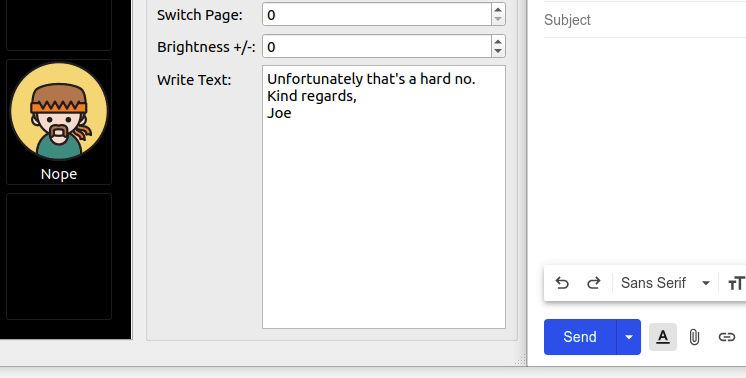

[](https://github.com/streamdeck-linux-gui/streamdeck-linux-gui)
_________________


## Installation Guides
* [Arch/Manjaro](installation/arch.md)
* [CentOS](installation/centos.md)
* [Fedora](installation/fedora.md)
* [NixOS](installation/nixos.md)
* [openSUSE](installation/opensuse.md)
* [Ubuntu/Mint](installation/ubuntu.md)

Once you're up and running, consider installing a [systemd service](installation/systemd.md).

> Use the [troubleshooting](troubleshooting.md) guide or [search](https://github.com/streamdeck-linux-gui/streamdeck-linux-gui/issues?q=is%3Aissue) the issues for guidance. If you cannot find on the issue on this repository please try searching on the original at [streamdeck_ui](https://githib.com/timothycrosley/streamdeck_ui/issues?q=is%Aissue).

### Precooked Scripts
There are scripts for setting up streamdeck_ui on [Debian/Ubuntu](https://github.com/streamdeck-linux-gui/streamdeck-linux-gui/blob/master/scripts/ubuntu_install.sh) and [Fedora](https://github.com/streamdeck-linux-gui/streamdeck-linux-gui/blob/master/scripts/fedora_install.sh).

## Help

### Start without showing the user interface

Note you can start streamdeck_ui without showing the configuration user interface as follows:
```
streamdeck -n
```
### Command
Enter a value in the command field to execute a command. For example, `gnome-terminal` will launch a new terminal on Ubuntu/Fedora or `obs` will launch OBS.

#### Examples 
> These examples are for Ubuntu using xorg.
You can use a tool like `xdotool` to interact with other applications.

Find the window with a title starting with `Meet - ` and bring it to focus. This helps if you have a Google Meet session on a tab somewhere but you lost it behind another window. 
``` console
xdotool search --name '^Meet - .+$' windowactivate 
```
> The meeting tab must be active one if you have multiple tabs open, since the window title is set by the currently active tab.

Find the window with a title starting with `Meet - ` and then send `ctrl+d` to it. This has the effect of toggling the mute button in Google Meet.
``` console
xdotool search --name '^Meet - .+$' windowactivate --sync key ctrl+d
```

Change the system volume up (or down) by a certain percentage. Assumes you're using PulseAudio/Alsa Mixer.
``` console
amixer -D pulse sset Master 20%+
```
If you want you invoke a command that uses shell-script specific things like `&&` or `|`, run it via bash. This command will shift focus to firefox using the `wmctrl`, and then shifts focus to the first tab: 

``` console
bash -c "wmctrl -a firefox  && xdotool key alt+1"
```

### Press Keys
Simulates key press combinations (hot keys). The basic format is a group of keys, separated by a `+` sign to press simultaneously. Separate key combination groups with a `,` if additional key combinations are needed. For example, `alt+F4,f` means press and hold `alt`, followed by `F4` and then release both. Next, press and release `f`. 

You can also specify a KeyCode in hex format, for example, `0x74` is the KeyCode for `t`. This is also sometimes called the keysym value.

> You can use the `xev` tool and capture the key you are looking for.
> In the output, look for the **keysym hex value**, for example `(keysym 0x74, t)`
>
> Use `comma` or `plus` if you want to actually *output* `,` or `+` respectively.
> 
> Use `delay <n>` to add a delay, where `<n>` is the number (float or integer) of seconds to delay. If `<n>` is not specified, 0.5 second default is used. If `<n>` fails to parse as a valid number, it will result in no delay.
> 

#### Examples
- `F11` - Press F11. If you have focus on a browser, this will toggle full screen.
- `alt+F4` - Closes the current window.
- `ctrl+w` - Closes the current browser tab.
- `cmd+left` - View split on left. Note `cmd` is the **super** key (equivalent of the Windows key).
- `alt+plus` - Presses the alt and the `+` key at the same time.
- `alt+delay+F4` - Press alt, then wait 0.5 seconds, then press F4. Release both.
- `1,delay,delay,2,delay,delay,3` - Type 123 with a 1-second delay between key presses (using default delay).
- `1,delay 1,2,delay 1,3` - Type 123 with a 1-second delay between key presses (using custom delay).
- `e,c,h,o,space,",t,e,s,t,",enter` - Type `echo "test"` and press enter.
- `ctrl+alt+0x74` - Opens a new terminal window. `0x74` is the KeyCode for `t`. TIP: If the character doesn't work, try using the KeyCode instead.
- `0xffe5` - Toggle Caps Lock.
- `0xffaf` - The `/` key on the numeric key pad.

The standard list of keys can be found [at the source](https://pynput.readthedocs.io/en/latest/_modules/pynput/keyboard/_base.html#Key).

The `super` key (Windows key) can be problematic on some versions of Linux. Instead of using the Key Press feature, you could use the Command feature as follows. In this example, it will press `Super` and `4`, which launches application number 4 in your favorites (Ubuntu).
```
xdotool key "Super_L+4"
```

### Write Text
A quick way of typing longer pieces of text (verbatim). Note that unlike the *Press Keys* action,
write text does not accept special (modifier) keys. However, if you type Enter (causing a new line) it will
press enter during the output.

#### Examples

```
Unfortunately that's a hard no.
Kind regards,
Joe
```

